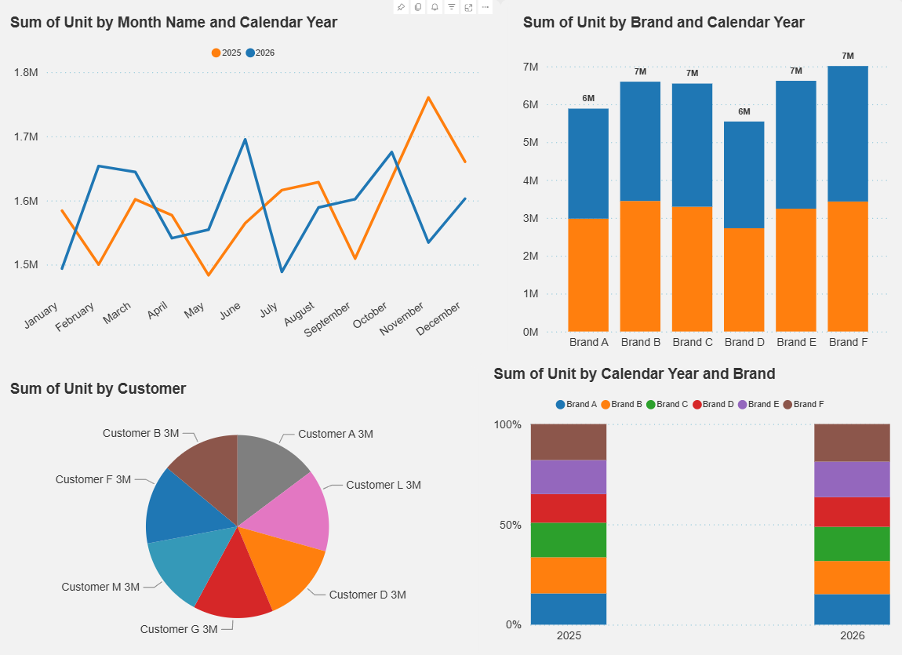
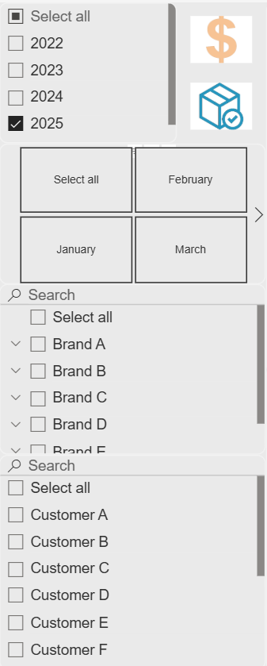
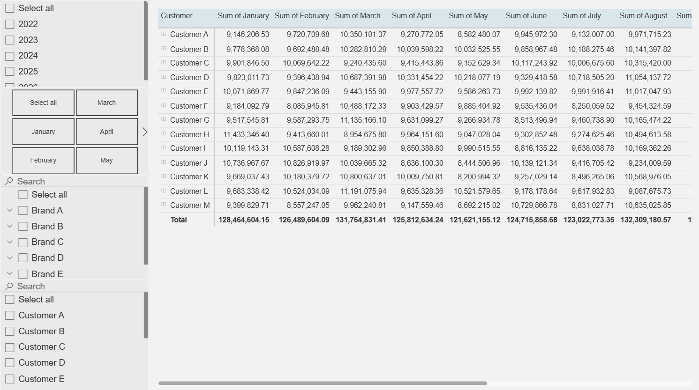

# Sales-Drilldown

A Power BI project built around a synthetic multi-brand CPG sales dataset. The data is intentionally dirty so the M code has real work to do: inconsistent casing, garbage type/variation values, and sub-brand names that need consolidating before anything is usable.

---

## Repo Structure

```
Sales-Drilldown/
├── data/
│   └── brand_dataset_raw_v2.xlsx
├── images/
│   ├── visuals.png
│   ├── filters.png
│   └── matrix.png
├── mcode.pq
├── dim_tables.pq
└── README.md
```

---

## The Dataset

38,000 rows across 6 brands, 13 customers, and 5 years (2022–2026). Each brand maps to a real CPG product category with its own cleaning logic:

| Brand | Logic |
|-------|-------|
| Brand A | Deodorant — roll-on vs stick, scented vs unscented |
| Brand B | Skincare — UV vs Core, variations by patch/scrub/mask/strip |
| Brand C | Self-tan — foam/drop/lotion/eraser/mitt, sun protection if body/face/lip |
| Brand D | Body lotion — cleanser = Global, everything else = Essentials |
| Brand E | Gradual tan — always Base type, variation driven by product format |
| Brand F | Haircare — shampoo/conditioner/styler/serum/treatment, dirty sub-brand names in raw |

Three intentional data quality issues the M code cleans:

1. **Inconsistent casing** on Brand and Item (`BRAND A`, `brand a`, `Brand A` all in the same column)
2. **Dirty Type and Variation columns** filled with garbage values (`TAN`, `body`, `REGULAR`, blanks) that get fully overwritten
3. **Brand F sub-brand names** (`Gloss Blonde`, `Smooth Frizz`, etc.) that need to be consolidated to `Brand F`

---

## M Code — Fact Table (`mcode.pq`)

Chains off Power Query's default auto-generated steps. Update the file path on the `Source` line before loading.

```powerquery
let
    Source = Excel.Workbook(File.Contents("C:\Users\ishaa\Downloads\Drilldown\brand_dataset_raw_v2.xlsx"), null, true),
    #"Raw Data_Sheet" = Source{[Item="Raw Data",Kind="Sheet"]}[Data],
    #"Promoted Headers" = Table.PromoteHeaders(#"Raw Data_Sheet", [PromoteAllScalars=true]),
    #"Changed Type" = Table.TransformColumnTypes(#"Promoted Headers",{{"Brand", type text}, {"Type", type text}, {"Variation", type text}, {"Item", type text}, {"Calendar Year", Int64.Type}, {"Calendar Month", Int64.Type}, {"Month Name", type text}, {"Customer", type text}, {"Unit", Int64.Type}, {"CAD", type number}}),

    // STEP 1: Uppercase Brand & Item for consistent matching
    #"Upper Case" = Table.TransformColumns(#"Changed Type", {
        {"Brand", each Text.Upper(Text.Trim(_)), type text},
        {"Item",  each Text.Upper(Text.Trim(_)), type text}
    }),

    // STEP 2: Flag display items (disp, PDQ, floorstand, etc.) — overrides Type to Display
    #"Display Flag" = Table.AddColumn(#"Upper Case", "_IsDisplay",
        each List.AnyTrue(List.Transform(
            {"DISP","PDQ","FLOORSTAND","PALLET","CLIPSTRIP","ENCAP","LAUNCH COUNTER","POWER"},
            (kw) => Text.Contains([Item], kw)
        )),
        type logical
    ),

    // STEP 3: Clean Brand — Brand F sub-names consolidated, casing variants normalised
    #"Clean Brand" = Table.AddColumn(#"Display Flag", "Brand_Clean",
        each
            let b = [Brand] in
            if List.Contains({"GLOSS BLONDE","VELVET BRUNETTE","SILK BRUNETTE","SMOOTH FRIZZ","GLOW RED","PURE BLONDE","LIFT VOLUME"}, b)
            then "Brand F"
            else if Text.StartsWith(b, "BRAND A") then "Brand A"
            else if Text.StartsWith(b, "BRAND B") then "Brand B"
            else if Text.StartsWith(b, "BRAND C") then "Brand C"
            else if Text.StartsWith(b, "BRAND D") then "Brand D"
            else if Text.StartsWith(b, "BRAND E") then "Brand E"
            else if Text.StartsWith(b, "BRAND F") then "Brand F"
            else b,
        type text
    ),

    // STEP 4: Assign Type — Display overrides all brands
    #"Clean Type" = Table.AddColumn(#"Clean Brand", "Type_Clean",
        each
            let b = [Brand_Clean], i = [Item] in
            if [_IsDisplay] then "Display"
            else if b = "Brand A" then if Text.Contains(i, "ROLL") then "Roll On" else "Stick"
            else if b = "Brand B" then
                if Text.Contains(i, "MIXED PRODUCT") or Text.Contains(i, "SERUM") or Text.Contains(i, "TREATMENT")
                then "Core" else "UV"
            else if b = "Brand C" then
                if Text.Contains(i, "BODY") or Text.Contains(i, "FACE") or Text.Contains(i, "LIP")
                then "Sun Protection" else "Self Tan"
            else if b = "Brand D" then if Text.Contains(i, "CLEANSER") then "Global" else "Essentials"
            else if b = "Brand E" then "Base"
            else if b = "Brand F" then
                if Text.Contains(i, "DETOX") then "Detox & Repair"
                else if Text.Contains(i, "SHAMPOO") or Text.Contains(i, "SHAMP") or Text.StartsWith(i, "SH ") then "Shampoo"
                else if Text.Contains(i, "CONDITIONER") or Text.Contains(i, "COND") or Text.StartsWith(i, "CD ") then "Conditioner"
                else if Text.Contains(i, "STYLER") then "Styler"
                else if Text.Contains(i, "SERUM") then "Serum"
                else if Text.Contains(i, "TREATMENT") or Text.Contains(i, "TRTMENT") or Text.Contains(i, " TRT") then "Treatment"
                else "Hair Care"
            else "Unknown",
        type text
    ),

    // STEP 5: Assign Variation — Gift Pack / On Pack fire globally before brand rules
    #"Clean Variation" = Table.AddColumn(#"Clean Type", "Variation_Clean",
        each
            let b = [Brand_Clean], i = [Item] in
            if Text.Contains(i, "GIFT PACK")       then "Gift Pack"
            else if Text.Contains(i, "MIXED PRODUCT") then "On Pack"
            else if b = "Brand A" then if Text.Contains(i, "UNSCENTED") then "Unscented" else "Scented"
            else if b = "Brand B" then
                if Text.Contains(i, "AQUA RICH")    then "Aqua Rich"
                else if Text.Contains(i, "PATCH")    then "Patches"
                else if Text.Contains(i, "SCRUB")    then "Cleanser"
                else if Text.Contains(i, "MASK")     then "Mask"
                else if Text.Contains(i, "CLEANSER") then "Cleanser"
                else if Text.Contains(i, "STRIP")    then "Pore Strips"
                else "General"
            else if b = "Brand C" then
                if Text.Contains(i, "FOAM")   then "Foam"
                else if Text.Contains(i, "DROP")   then "Drops"
                else if Text.Contains(i, "ERASER") then "Eraser"
                else if Text.Contains(i, "MITT")   then "Mitt"
                else if Text.Contains(i, "LOTION") then "Lotion"
                else "General"
            else if b = "Brand D" then
                if Text.Contains(i, "FOOT")           then "Foot"
                else if Text.Contains(i, "MOISTURI")   then "Moisturizers"
                else if Text.Contains(i, "FACE CREAM") then "Base Cream"
                else if Text.Contains(i, "CLEANSER")   then "Cleansers"
                else "Base"
            else if b = "Brand E" then
                if Text.Contains(i, "MITT")            then "Mitt"
                else if Text.Contains(i, "TOWELETTE")  then "Towelette"
                else if Text.Contains(i, "INSTANT SUN") then "Instant"
                else if Text.Contains(i, "HYDRA GEL")  then "Hydra Gel"
                else "Gradual"
            else if b = "Brand F" then
                if Text.Contains(i, "DETOX")       then "Detox and Repair"
                else if Text.Contains(i, "DEEP SEA") then "Deep Sea"
                else if Text.Contains(i, "SHAMPOO") or Text.Contains(i, "SHAMP") or Text.StartsWith(i, "SH ") then "Shampoo"
                else if Text.Contains(i, "CONDITIONER") or Text.Contains(i, "COND") or Text.StartsWith(i, "CD ") then "Conditioner"
                else if Text.Contains(i, "STYLER")    then "Styler"
                else if Text.Contains(i, "SERUM")     then "Serum"
                else if Text.Contains(i, "TREATMENT") or Text.Contains(i, "TRTMENT") or Text.Contains(i, " TRT") then "Treatment"
                else "General"
            else "General",
        type text
    ),

    // STEP 6: Title-case Item
    #"Title Case Item" = Table.TransformColumns(#"Clean Variation", {
        {"Item", each Text.Proper(_), type text}
    }),

    // STEP 7: Drop helper columns, swap in cleaned Brand/Type/Variation
    #"Remove Helpers"   = Table.RemoveColumns(#"Title Case Item", {"Brand", "Type", "Variation", "_IsDisplay"}),
    #"Rename Clean Cols" = Table.RenameColumns(#"Remove Helpers", {
        {"Brand_Clean", "Brand"}, {"Type_Clean", "Type"}, {"Variation_Clean", "Variation"}
    }),

    // STEP 8: Reorder to original column layout
    #"Reorder Columns" = Table.ReorderColumns(#"Rename Clean Cols", {
        "Brand", "Type", "Variation", "Item",
        "Calendar Year", "Calendar Month", "Month Name",
        "Customer", "Unit", "CAD"
    }),

    // STEP 9: Sort by Year, Month, Brand
    #"Sorted" = Table.Sort(#"Reorder Columns", {
        {"Calendar Year", Order.Ascending},
        {"Calendar Month", Order.Ascending},
        {"Brand", Order.Ascending}
    })

in
    #"Sorted"
```

---

## M Code — Dim Tables (`dim_tables.pq`)

Six queries referencing the cleaned fact table. Paste each block as its own blank query in Power Query and rename accordingly in the left panel.

> Internal step names use `Output` instead of `Sorted` to avoid a cyclic reference error.

```powerquery
// ── DIM BRAND ──
let
    Source   = Sorted,
    KeepCol  = Table.SelectColumns(Source, {"Brand"}),
    Distinct = Table.Distinct(KeepCol),
    Output   = Table.Sort(Distinct, {{"Brand", Order.Ascending}})
in Output

// ── DIM CUSTOMER ──
let
    Source   = Sorted,
    KeepCol  = Table.SelectColumns(Source, {"Customer"}),
    Distinct = Table.Distinct(KeepCol),
    Output   = Table.Sort(Distinct, {{"Customer", Order.Ascending}})
in Output

// ── DIM MONTH ──
let
    Source   = Sorted,
    KeepCols = Table.SelectColumns(Source, {"Calendar Month", "Month Name"}),
    Distinct = Table.Distinct(KeepCols),
    Output   = Table.Sort(Distinct, {{"Calendar Month", Order.Ascending}})
in Output

// ── DIM TYPE ──
let
    Source   = Sorted,
    KeepCol  = Table.SelectColumns(Source, {"Type"}),
    Distinct = Table.Distinct(KeepCol),
    Output   = Table.Sort(Distinct, {{"Type", Order.Ascending}})
in Output

// ── DIM VARIATION ──
let
    Source   = Sorted,
    KeepCol  = Table.SelectColumns(Source, {"Variation"}),
    Distinct = Table.Distinct(KeepCol),
    Output   = Table.Sort(Distinct, {{"Variation", Order.Ascending}})
in Output

// ── DIM YEAR ──
let
    Source   = Sorted,
    KeepCol  = Table.SelectColumns(Source, {"Calendar Year"}),
    Distinct = Table.Distinct(KeepCol),
    Output   = Table.Sort(Distinct, {{"Calendar Year", Order.Ascending}})
in Output
```

---

## Dashboard

### Main Visuals


Line chart of units by month (2025 vs 2026), stacked bar by brand and year, pie by customer, and a 100% stacked bar showing brand mix per year.

### Filters


Year slicer, month tile slicer, hierarchical brand slicer (drills into type and variation), and customer slicer.

### Customer x Month Matrix


Sum of CAD by customer on rows and month on columns. Useful for spotting seasonal patterns per customer.

---

## How to Use

1. Download `brand_dataset_raw_v2.xlsx` from the `data/` folder
2. Open Power BI Desktop and create a new blank query
3. Paste the fact table code from `mcode.pq` into the Advanced Editor — update the file path on the `Source` line
4. For each dim table in `dim_tables.pq`, create a new blank query and paste the corresponding block
5. Rename each query in the left panel (`Dim Brand`, `Dim Customer`, etc.)
6. Close and apply, then build your visuals

---

## Stack

- Power BI Desktop
- Power Query M
- Python (pandas, openpyxl) for dataset generation
